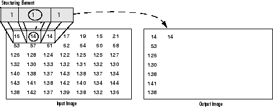
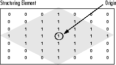

# Image Proc

The ImageProc benchmark suite includes a variety of image processing operations to evaluate the performance and capabilities of different algorithms. These benchmarks cover fundamental operations such as morphology and line extraction, as well as advanced techniques like non-photorealistic rendering and text skewness correction. Image processing is essential in fields such as computer vision, graphics, and photography, where it is used to enhance, analyze, and manipulate images.

|          TEST           |    STATUS    |
| ------------------------| -------------|
| Morphology Operation    | |
| Line Extraction         | |
| Cloning                 | |
| Delaunay Triangulation & Voronoi Tessellation     | |
| Line Segment Detection   | |
| Non-Photorealistic Rendering  | |
| Text Skewness Correction      | |
| Watershed  | |

## Morphology Operation

Morphology is a set of image processing operations that process images based on predefined structuring elements known also as kernels. The value of each pixel in the output image is based on a comparison of the corresponding pixel in the input image with its neighbors. By choosing the size and shape of the kernel, you can construct a morphological operation that is sensitive to specific shapes regarding the input image.

 The most basic morphological operations are: Erosion and Dilation. They have a wide array of uses, i.e. :
    -   Removing noise
    -   Isolation of individual elements and joining disparate elements in an image.
    -   Finding of intensity bumps or holes in an image

### Dilation

-   This operations consists of convolving an image \f$A\f$ with some kernel (\f$B\f$), which can have any shape or size, usually a square or circle.
-   The kernel \f$B\f$ has a defined *anchor point*, usually being the center of the kernel.
-   As the kernel \f$B\f$ is scanned over the image, we compute the maximal pixel value overlapped by \f$B\f$ and replace the image pixel in the anchor point position with that maximal value. As you can deduce, this maximizing operation causes bright regions within an image to "grow" (therefore the name *dilation*).
-   The dilatation operation is: \f$\texttt{dst} (x,y) =  \max _{(x',y'):  \, \texttt{element} (x',y') \ne0 } \texttt{src} (x+x',y+y')\f$

### Erosion

-   This operation is the sister of dilation. It computes a local minimum over the area of given kernel.
-   As the kernel \f$B\f$ is scanned over the image, we compute the minimal pixel value overlapped by \f$B\f$ and replace the image pixel under the anchor point with that minimal value.
-   The erosion operation is: \f$\texttt{dst} (x,y) =  \min _{(x',y'):  \, \texttt{element} (x',y') \ne0 } \texttt{src} (x+x',y+y')\f$

## Line Extraction

Line extraction involves detecting lines in an image, which is a crucial step in many computer vision applications such as feature detection and image segmentation. 
Here we are applying the two very common morphology operators (i.e. Dilation and Erosion), with the creation of custom kernels, in order to extract straight lines on the horizontal and vertical axes.For this purpose, you will use the following OpenCV functions:

-   **erode()**
-   **dilate()**
-   **getStructuringElement()**

-   __Dilation__: The value of the output pixel is the <b><em>maximum</em></b> value of all the pixels that fall within the structuring element's size and shape. For example in a binary image, if any of the pixels of the input image falling within the range of the kernel is set to the value 1, the corresponding pixel of the output image will be set to 1 as well. The latter applies to any type of image (e.g. grayscale, bgr, etc).

    

    

-   __Erosion__: The vice versa applies for the erosion operation. The value of the output pixel is the <b><em>minimum</em></b> value of all the pixels that fall within the structuring element's size and shape. Look the at the example figures below:

    

    

-   __Structuring Elements__: As it can be seen above and in general in any morphological operation the structuring element used to probe the input image, is the most important part.

A structuring element is a matrix consisting of only 0's and 1's that can have any arbitrary shape and size. Typically are much smaller than the image being processed, while the pixels with values of 1 define the neighborhood. The center pixel of the structuring element, called the origin, identifies the pixel of interest -- the pixel being processed.

For example, the following illustrates a diamond-shaped structuring element of 7x7 size.

A structuring element can have many common shapes, such as lines, diamonds, disks, periodic lines, and circles and sizes. You typically choose a structuring element the same size and shape as the objects you want to process/extract in the input image. For example, to find lines in an image, create a linear structuring element as you will see later.

## Cloning

This tutorial demonstrates how to use OpenCV seamless cloning module without GUI. Cloning operations involve copying parts of an image to another location within the same image or to a different image. This can be done in various modes:

- Normal: Normal cloning is a straightforward copying of the source image to the destination.
- Mixed : Mixed cloning blends the cloned area with the destination area using alpha blending or other techniques to create a seamless transition.
- Color Change : Color change cloning adjusts the color properties of the cloned area to match the destination area.
- Illumination Change : Illumination change cloning modifies the brightness or lighting conditions of the cloned area to integrate with the destination area.
- Monochrome Transfer : Monochrome transfer cloning copies the source image as a monochrome (black and white) image onto the destination.
- Texture Flattening : Texture flattening cloning is used to smooth out textures or patterns in the cloned area to make it blend better with the surrounding area.

## Delaunay Triangulation & Voronoi Tessellation

Delaunay triangulation and Voronoi tessellation are geometric methods used for dividing a plane into regions based on distance to a specified set of points. These techniques are useful in various fields such as computer graphics and spatial analysis.

This program demonstrates iterative construction of delaunay triangulation and voronoi tessellation. It draws a random set of points in an image and then delaunay triangulates them.

## Line Segment Detection

Line segment detection involves identifying straight lines in an image. This is a fundamental task in image analysis and computer vision, useful for recognizing shapes, patterns, and structures.

The LSD algorithm offers different levels of refinement for the detected line segments. These refinements can improve the precision and quality of the detected lines but may also increase the computational cost. The refinement methods provided by the LSD algorithm:

-   __LSD_REFINE_NONE__: No refinement. The algorithm detects and returns the line segments as they are found, without any post-processing.
-   __LSD_REFINE_STD__: Standard refinement. The algorithm adjusts the endpoints of the line segments to sub-pixel accuracy, improving the precision of the detected lines.
-   __LSD_REFINE_ADV__:Advanced refinement. The algorithm further improves the accuracy of the line segments by minimizing a weighted sum of squared distances between the points and the line segments.

